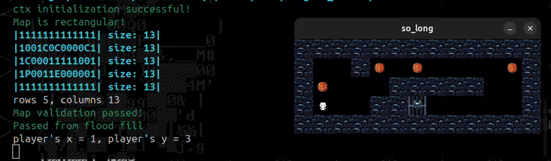

<h1 align="center"> so_long - @42tr </h1>

<div align="center">

  # Phantom's Escape - 42 So_Long

  <p align="center"><a href="https://github.com/aabdulmecitz/42-so_long" target="_blank"> </a></p>

  [](https://forthebadge.com)
  [](https://forthebadge.com)

   <a img src="https://img.shields.io/badge/score-125%20%2F%20100-success?style=for-the-badge"/></a>
   <a img src="https://img.shields.io/badge/circle-2-magenta?style=for-the-badge"/></a>
   <a img src="https://img.shields.io/badge/42-Evaluation-red?style=for-the-badge"/></a>

  <p align="center"><a href="https://https://42istanbul.com.tr/" target="_blank"></a></p>

  <p align="center">125/100 :white_check_mark:</p>

  
  
  *Animated Ghost Adventure with Dynamic Enemy AI*

  
  
  *Multiple Map Layouts and Challenges*
</div>

## :ghost: About

Phantom's Escape is not just another So_Long project - it's a haunting adventure that pushes the boundaries of the MLX library with:
- Advanced animation system using variadic functions
- Fluid character movements with 8-directional animations
- Dynamic enemy AI with pathfinding
- Atmospheric visual effects

<div align="center">
  
</div>

## :sparkles: Unique Features

### Animation System
- **Variadic Function Innovation**: Custom animation engine that handles multiple sprite sequences
- **Smooth Transitions**: Frame-perfect animation timing
- **Memory Efficient**: Linked list-based sprite management
- **Dynamic Updates**: Real-time frame calculations

### Enemy AI
- **Wandering Spirits**: Intelligent pathfinding system
- **Toxic Rivers**: Strategic obstacle placement
- **Pattern Recognition**: Predictable yet challenging enemy movements

<div align="center">
  
</div>

## :gear: Technical Highlights

```c
void init_animation(t_ctx *ctx, t_img *img, ...)
{
    va_list args;
    const char *current_path;
    
    va_start(args, img);
    while ((current_path = va_arg(args, const char *)))
    {
        // Dynamic sprite loading
    }
    va_end(args);
}
```

<h1 align="center">42 SO_LONG</h1>

<p align="center">
  A haunting tale of escape, built with advanced primitive animation systems
</p>

<div align="center">
  <a href="mailto:aozkaya@student.42.fr">❔ Ask a Question</a> ·
  <a href="https://github.com/aabdulmecitz/42-so_long/issues">🪲 Report Bug</a> ·
  <a href="https://github.com/aabdulmecitz/42-so_long/issues">💬 Request Feature</a>
</div>

<div align="center">
  
  
  *The Phantom's Quest for Freedom*
</div>

## 🎮 Game Preview

<div align="center">
  
</div>

## 🌟 What Makes This Project Unique

This implementation of So_Long stands out for its sophisticated animation system and rich gameplay mechanics:

### Technical Innovation
- **Advanced Animation Engine**: Utilizes variadic functions for flexible sprite management
- **Dynamic Frame System**: Each entity (player, enemies, collectibles) has unique animation sequences
- **Memory-Efficient Design**: Custom-built linked list system for sprite sequence handling
- **Smooth Transitions**: Frame-perfect animation timing for fluid movement

### Architectural Highlights
- Modular animation system allowing easy addition of new sprites
- Innovative use of variadic functions for sprite sequence management
- Custom-built frame timing system for smooth animations
- Memory-efficient design using linked lists for sprite management

## 🏰 The Tale of the Wandering Spirit

In the depths of the Ancient Ghost Castle, a young spirit named Phantom awakens to find himself trapped in the castle's deepest dungeon. Unlike other ghosts who have accepted their eternal imprisonment, Phantom yearns for freedom beyond the castle walls.

The castle, however, holds a mysterious secret. The ancient magical doors that lead to freedom are sealed by an arcane spell, bound to the scattered soul crystals (collectibles) throughout the dungeon. These crystals, glowing with ethereal energy, are the key to Phantom's escape.

But escape won't be easy. The dungeon is patrolled by:
- **Toxic Rivers**: Ancient magical barriers that can dissolve even a ghost's form
- **Wandering Sentinels**: Other spirits bound to guard the dungeon for eternity

To break free, Phantom must:
1. Collect all soul crystals to weaken the magical seal
2. Avoid the toxic rivers that can dissolve his spectral form
3. Evade the watchful guardian spirits
4. Reach the enchanted door before the castle realizes his escape attempt

### Your Mission
Guide Phantom through the haunted halls, collecting all soul crystals while avoiding the dangers. Only by gathering every crystal can you break the seal and open the path to freedom.

# 42 So Long Project

A simple 2D game project that introduces game development concepts using the MinilibX graphics library.

## 🎮 About The Project

So_long is a 2D game where players navigate through a map, collecting items while avoiding enemies to reach the exit. The project teaches fundamental concepts of game development, graphics programming, and memory management in C.

## 🚀 Mandatory Part

The basic version includes:
- Map parsing from a .ber file
- Basic graphics rendering using MinilibX
- Player movement (WASD/Arrow keys)
- Collectible items
- Simple exit condition
- Basic error handling
- Memory management

### Core Features
- Wall collision detection
- Item collection tracking
- Move counter
- Clean exit handling

## 🌟 Bonus Features

The bonus version extends the base game with:

### Advanced Animation System
- Custom animation engine using variadic functions
- Sprite animation sequences
- Dynamic frame updates
- Smooth movement animations

### Enhanced Gameplay
- Enemy patrols with AI movement
- Multiple enemy types:
  - Static enemies (toxic areas)
  - Moving enemies with pathfinding
- Animated collectibles
- Enhanced visual feedback

### Technical Highlights
- **Variadic Function Implementation**: Unique approach to handling multiple sprite animations
- **Animation Sequences**: Custom-built animation system using linked lists
- **Memory Management**: Careful handling of dynamic resources
- **Event Loop**: Smooth game loop with proper timing

## 🚀 Getting Started

### Prerequisites
- GCC compiler
- Make
- X11 development libraries
- MinilibX library (included)

### Installation Steps
1. Clone the repository:
   ```bash
   git clone https://github.com/aabdulmecitz/42-so_long.git
   cd 42-so_long
   ```

2. Compile the project:
   - For mandatory version:
     ```bash
     make
     ```
   - For bonus version with animations:
     ```bash
     make bonus
     ```

### Creating Your First Map
1. Create a `.ber` file in the `maps` directory
2. Follow the map format rules:
   ```
   1111111111111
   10010000000C1
   1000011111001
   1P0011E000001
   1111111111111
   ```

### Map Rules
- Must be rectangular
- Must be surrounded by walls ('1')
- Must contain:
  - One player (P)
  - At least one collectible (C)
  - One exit (E)
- Must be possible to reach all collectibles and exit

### Running the Game
```bash
# Run mandatory version
./so_long maps/your_map.ber

# Run bonus version
./so_long_bonus maps/your_map.ber
```

### Controls
- Movement: WASD or Arrow keys
- Exit: ESC or Q
- Objective: Collect all items before reaching exit

## 🎯 Development Guide

### 1. Map Parsing (2-3 days)
- Implement file reading
- Validate map format
- Check map requirements
- Handle errors

### 2. Graphics Setup (2-3 days)
- Initialize MinilibX
- Load sprites
- Create window
- Basic rendering

### 3. Game Logic (3-4 days)
- Player movement
- Collision detection
- Collectible handling
- Exit condition

### 4. Bonus Features (4-5 days)
- Enemy AI
  - Static enemies (toxic areas)
  - Moving enemies with pathfinding
- Animation system
  - Sprite sequences
  - Frame timing
  - Smooth transitions

### 5. Memory Management
- Free all allocated memory
- Handle cleanup on exit
- Prevent memory leaks

### Common Challenges
1. **Memory Leaks**
   - Use Valgrind for testing
   - Free resources in correct order

2. **Animation Timing**
   - Implement frame delay
   - Handle multiple animations

3. **Enemy Movement**
   - Basic pathfinding
   - Collision detection
   - Movement patterns

### Testing
1. **Map Testing**
   - Invalid maps
   - Edge cases
   - Different sizes

2. **Memory Testing**
   ```bash
   valgrind --leak-check=full ./so_long maps/valid_map.ber
   ```

3. **Gameplay Testing**
   - All movement directions
   - Collectible counting
   - Exit functionality
   - Enemy interactions

## 🔍 Key Learning Points
- Graphics programming fundamentals
- Event handling in games
- Memory management
- Animation systems
- Game development patterns
